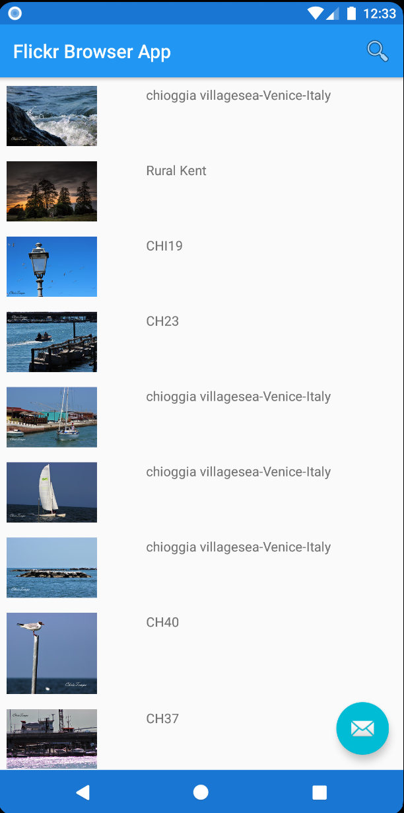
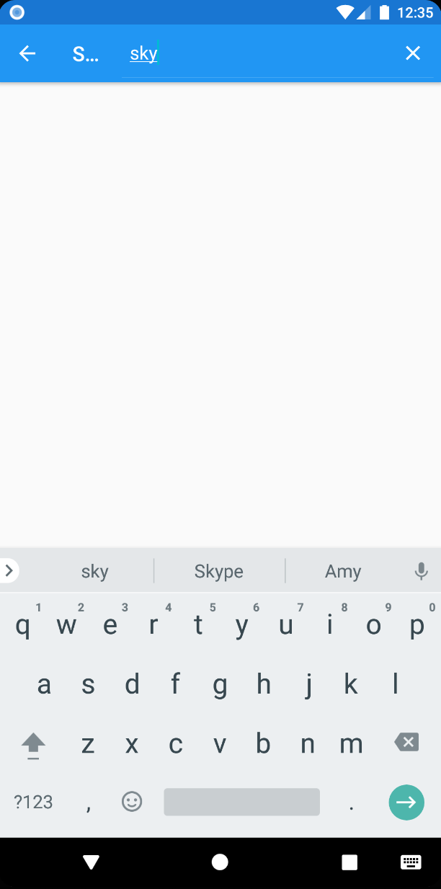
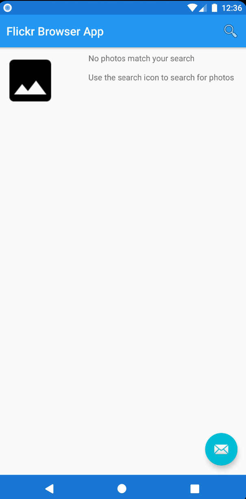

# Flickr Browser App

Android mobile application built in Kotlin that lets users search one of the largest image databases
in the world on their phones using Flickr API

## Visuals

  

                 

## Contributing
Pull requests are welcome. For major changes, please open an issue first to discuss what you would like to change.

Please make sure to update tests as appropriate.
